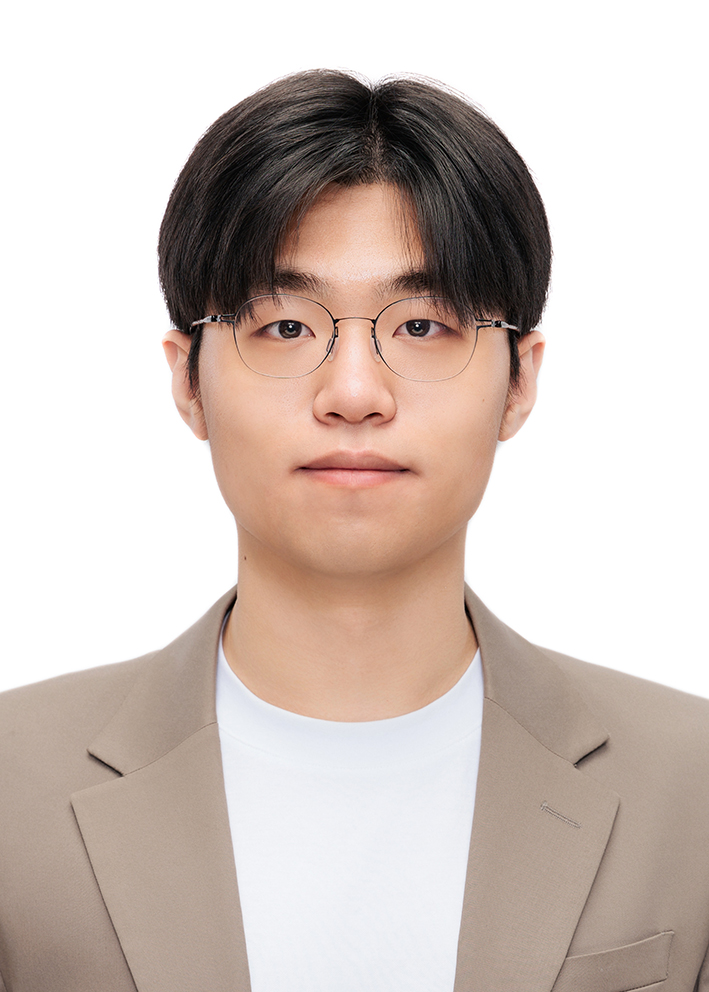

Hi, my name is Yueun Lee. I'm a fourth-year undergraduate student at Seoul National University, majoring in Statistics, Mathematics, and Computer Science & Engineering. My academic journey is focused on exploring rigorous mathematical principles that shape the development of computational methods. I am particularly interested in machine learning (ML) and numerical analysis for algorithm design. For more information, you can view my [CV](CV.pdf) and an overview of the [advanced mathematics courses](Advanced_Mathematics_Courses_List.pdf) I have studied.